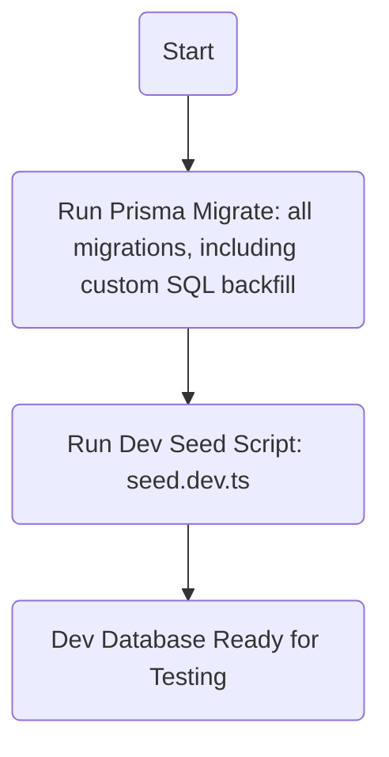
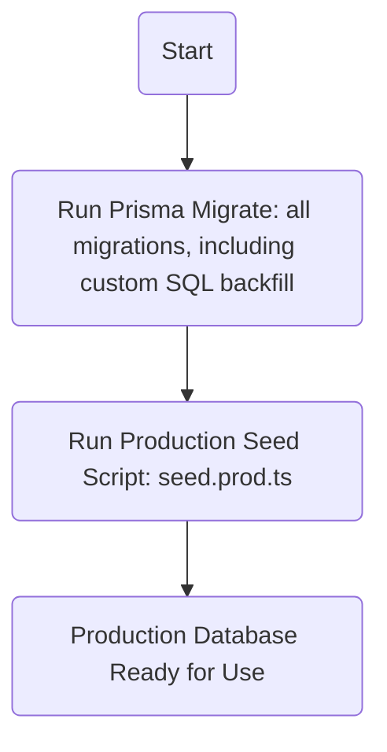

# Person & Membership Refactor

## 1. Database & Schema
- [x] Design and add a `Person` table (unique `personId`, name, email, etc.).
- [x] Create a join table (`HouseholdMembership`) linking `personId` and `familyId`, with membership-specific fields.
- [x] Migrate existing `householdMember` data to use the new structure (via automated SQL backfill migration).
- [x] Update all foreign keys and references in transactions, split ratios, etc., to use the join table.

## 2. Backend Logic
- [x] Refactor backend models and services to use `Person` and `HouseholdMembership`.
- [x] Update APIs for creating, updating, and querying persons and memberships (in progress, see upcoming tasks).
- [ ] Implement logic to prevent duplicate persons (e.g., by email/phone).
- [x] Add migration scripts for existing data.

## 3. UI/UX
- [ ] Update UI to be person-centric when adding household members.
- [ ] Implement person search/autocomplete when adding a member to a family.
- [ ] Show all families a person belongs to in their profile.
- [ ] Allow admins to add new persons or link existing ones when creating memberships.
- [ ] Ensure person-level reports aggregate across all memberships.

## 4. Security & Permissions
- [ ] Update permissions to use `personId` for access control.
- [ ] Ensure users can only view/manage their own data or data they have rights to.

## 5. Automation & Self-Service
- [ ] Implement logic for users to request to join families or for admins to invite persons by email.
- [ ] Automate linking of persons during data import or seeding.

## 6. Testing & Documentation
- [x] Write migration and integration tests for the new schema (dev tested, see automation notes).
- [x] Update documentation for the new person/membership model and workflows (see this file and seed/migration scripts).

---

**Note:**
This refactor will greatly improve data integrity, security, and scalability, and will make person-level reporting and permissions robust and future-proof.
# Sprint 5: Multi-Family, Real-Time, and State Retention Fixes (2025-07-08)

## Major Functional Changes & Fixes

### 1. Real-Time Updates & WebSocket Event Routing
- Diagnosed and fixed issue where the transactions page stopped receiving real-time updates. Root cause: backend was emitting to personId rooms, but clients joined userId rooms. Solution: backend now maps person.email to userId and emits transaction events to userId rooms.
- Ensured categories and household members pages continue to work by keeping their backend event emission logic consistent (emit to userId rooms).
- Added logging to backend transaction service to confirm correct userId emission for WebSocket events.

### 2. DTO & Validation Changes
- Removed/disarmed UUID validation for `categoryId` and `payer` in `CreateTransactionDto` to support new ID formats (string, not just UUID).
- Updated backend and frontend logic to support new ID mapping and access rules (family tree access, not just direct family match).

### 3. Access Control & Family Tree Logic
- Updated category and household member service access logic to allow access if the resource's familyId is in the user's family tree (self or ancestor), not just a direct match.
- Added technical note: Never trust client-supplied values for sensitive identifiers such as `familyId`, `userId`, etc. Always use the authenticated user's/session's value from the server context in all controller and service logic.

### 4. Frontend State Retention & Pinia Store
- Add Transaction page now retains last selected family, payer, and date using Pinia store (`transactionStore`).
- Added `lastSelectedFamilyId`, `lastSelectedPayer`, `lastSelectedDate` to `transactionStore` and wired up watchers and initialization logic in `QuickEntryForm.vue`.
- Watchers only update last selected values if the value is not null/empty and has changed, to avoid unnecessary state churn.
- Exported `loadTransactions` and `loadTransactionsForCategoryPeriod` from `transactionStore` to resolve missing method errors in components.

### 5. Debugging & Lessons Learned
- Diagnosed and explained why payer was showing as ID instead of name (frontend not refreshing household members or mismatch in IDs).
- Identified and explained missing method errors in transactionStore and provided solution to export them from the store.
- Documented all changes and lessons in this file and in the technical highlights for future reference.

---

## Regression Prevention Checklist
- [x] All real-time update logic for transactions, categories, and household members tested and verified.
- [x] All DTO and validation changes tested for both old and new ID formats.
- [x] Access control and family tree logic tested for direct and ancestor family access.
- [x] State retention for add transaction page tested across navigation and reloads.
- [x] All Pinia store methods used in components are exported and type-safe.
- [x] All changes and lessons documented in backlog and technical highlights.

---

**Key Principle:**
- Every time a bug is fixed or a feature is changed, document the root cause, the solution, and the impact on other features. Test all related features to prevent regressions. Never assume a change is isolated—always verify and document.

# Sprint 5: Foundational Data Model Refactor

**Sprint Goal:** Refactor the core data model to support a hierarchical "Family" structure. This will enable multiple "Small Families" (sub-groups) to exist within a "Big Family" (the main household), allowing for more granular data ownership, permissions, and reporting. This is a foundational change to support future multi-family features.

---

## Key Features & User Stories

- **As a household admin,** I want to define my main household ("Big Family") and create sub-groups ("Small Families") within it.
- **As a user,** I want my data (categories, transactions, etc.) to be associated with my specific "Small Family" to keep it separate from others.
- **As a user,** I want to see reports and summaries that are scoped to my "Small Family" or the entire "Big Family".

---

## Technical Backlog

### Backend

- [ ] **Data Model (Prisma):**
    - [x] Define `Family` model (to represent both Big and Small families, possibly with a self-referencing `parentId`).
    - [x] Add a `familyId` to `User`, `Category`, `Transaction`, `HouseholdMember`, `PredefinedSplitRatio`, and `Settlement` models.
    - [x] Remove the direct `userId` link from these models where ownership should now be determined by `Family`.
    - [x] Create a new migration for these schema changes.
- [ ] **API (Authorization):**
    - [ ] Refactor all services (`category.service`, `transaction.service`, etc.) to enforce data access rules based on the user's `familyId`.
    - [ ] A user should only be able to read/write data belonging to their own `Family` or a parent `Family` they are part of.
    - [ ] Update `JwtAuthGuard` or create a new `FamilyGuard` to inject family information or perform checks.
- [ ] **API (Endpoints):**
    - [ ] Create CRUD endpoints for managing families (`/families`).
    - [ ] Update all existing `GET` endpoints to filter by the user's `familyId`.
    - [ ] Update all `POST`/`PATCH`/`DELETE` endpoints to validate ownership via `familyId`.
- [ ] **Seed Script:**
    - [x] Update `seed.ts` to create a default "Big Family" and a "Small Family" and associate the test user and all seeded data with them.

---

## ⚠️ TODO: FamilyId vs UserId Authorization Bugs (Sprint 5)

**Known technical debt (to revisit):**

- [ ] TransactionController: `findOne` still uses `body.familyId` (from client) instead of `req.user.familyId`.
- [ ] TransactionController: `update` still uses `req.user.id` (userId) instead of `req.user.familyId`.
- [ ] TransactionController: `remove` still uses `body.familyId` (from client) instead of `req.user.familyId`.
- [ ] Review all controllers for any place where userId is used as familyId or for access control (see grep_search results and TODOs in code).

> These are marked with TODOs in the code. See also the lessons learned in `.github/instructions` and `prompt-baseline.md`.

### Frontend

- [ ] **State Management:**
    - [ ] Create a `familyStore.ts` to manage family data.
    - [ ] Update all other stores (`categoryStore`, `transactionStore`, etc.) to be aware of the current family context.
    - [ ] Modify API service calls to work with the new family-scoped endpoints.
- [ ] **UI:**
    - [ ] Create a new page for Family Management (`FamilyManagementPage.vue`).
    - [ ] Add a UI element (e.g., a dropdown in the layout) to allow users to switch between their "Small Family" view and the "Big Family" view.
    - [ ] Update all existing pages (`ReportsPage`, `TransactionsPage`, etc.) to reflect the currently selected family scope.

## ⚠️ Family Model Migration & Backfill Automation Notes (2025-07-01)

- The migration from user-centric to family-centric data is a multi-step process that must be automated for CI/CD and production safety.
- **Key steps:**
  1. **Schema migration (optional familyId):**
     - Run the migration that adds `familyId` columns as nullable, with no NOT NULL or foreign key constraints.
  2. **Data backfill migration:**
     - A dedicated migration (e.g., `20250629090000_backfill_families`) runs custom SQL to populate all `familyId` fields and insert new Family/member records as needed.
     - This SQL must be in a migration file so it runs automatically in the pipeline (not as a manual script).
  3. **Constraint migration:**
     - After backfill, run the migration that sets `familyId` as NOT NULL and adds foreign key constraints.
- **Important:**
  - `prisma migrate deploy` always runs all migrations in order; it does not pause for manual steps.
  - The backfill SQL must be a migration file between the schema and constraint migrations.
  - Do not manually edit or skip migrations in production—always use the migration files and pipeline.
- **If you need to repeat this process:**
  - Place any custom data backfill SQL in its own migration folder.
  - Ensure the order: schema → backfill → constraints.
  - Test the full migration sequence in a staging environment before production.

## Migration & Seed Execution Plan (2025-07-01)

### Dev Environment

- All migrations (including schema changes and the custom SQL backfill migration) are run automatically as part of `prisma migrate`.
- The dev seed script (`seed.dev.ts`) is executed to populate baseline and test data.
- The database is now ready for development and testing.

#### Local Dev Database Reset & Test Flow (2025-07-02)

To fully reset and test the dev database with the latest schema and seed data:

1. Set the environment variable for development:
   - On Linux/macOS bash: `export NODE_ENV=development`
   - On Windows CMD: `set NODE_ENV=development`
2. Drop the dev database (replace `youruser` with your actual DB user):
   - `docker exec -it qltc-postgres psql -U youruser -d postgres -c "DROP DATABASE IF EXISTS qltc_db;"`
3. Run all migrations (including custom SQL backfill):
   - `npx prisma migrate deploy`
4. Seed the database with dev data:
   - `npx ts-node ./prisma/seed.ts`

This will ensure your dev environment is always in sync with the latest schema, migrations, and seed data. The orchestrator script will automatically run the correct seed for development.

**Best Practice:** Always use the orchestrator (`seed.ts`) and never run `seed.dev.ts` or `seed.prod.ts` directly.

### Production Environment

- All migrations (including schema changes and the custom SQL backfill migration) are run automatically as part of `prisma migrate`.
- The production seed script (`seed.prod.ts`) is executed to populate only minimal, safe baseline data.
- The database is now ready for production use.

**Key Differences:**
- The dev environment uses `seed.dev.ts` for rich, testable data.
- The production environment uses `seed.prod.ts` for minimal, safe data.

> **Note:**
> The correct seed script is executed via the orchestrator `seed.ts`, which detects the environment (development or production) and runs either `seed.dev.ts` or `seed.prod.ts` accordingly. Do not run the seed scripts directly; always use `seed.ts` for consistent behavior.

# Sprint 5+ Backlog & Roadmap (Refined)

## Current Sprint (Sprint 5): Household Member & Person Management
- [x] Normalize schema: Family, Person, HouseholdMembership (done)
- [x] Migrate and seed baseline data (done)
- [x] Implement Person API (CRUD, deduplication by name, auth) (done)
- [x] Implement Membership API (link person to family, prevent duplicates) (done)
- [x] Secure APIs with JWT (done)
- [x] Test all flows (done)
- [x] Update frontend: Household Member page
  - [x] Display household members grouped by family in a hierarchical view.
  - [x] For a normal user, the view is read-only and only shows families they are a member of.
  - [x] Show person details (name, email, phone) for each member.

## Notes
- For now, role assignment and cross-family membership are managed manually via DB.
- All new users are assigned to their own default family as admin.
- Only one big family and several small families are supported for now; nesting is allowed.
- Role management and invitation flows are hypotheses for future sprints, not current priorities.

## Categories Management: Family-Aware Refactor (Sprint 5)
- [ ] Update backend: Ensure all category endpoints require and check `familyId` for all CRUD operations
    - [ ] Add/Update: Only allow creation/edit for categories in the current family context
    - [ ] Delete: Only allow deletion for categories in the current family context
    - [ ] List: Only return categories for the current family (and/or subfamilies, if required)
- [ ] Update backend: Enforce access control so only family members can manage their family's categories
- [ ] Update backend: Add tests for family-aware category permissions
- [x] Update categoryStore: Load categories for the current family context only *(Now fetches for current and parent family)*
- [x] Update categoryStore: Add, edit, and delete actions must include current `familyId`
- [x] Update categoryStore: Implement WebSocket handlers for real-time, in-place updates *(New task)*
- [x] Update CategoriesPage.vue: Display categories grouped or filtered by family
- [x] Update CategoriesPage.vue: Add/Edit dialogs show and use the current family context
    - [x] "Add Root": Allow family selection (current/parent), defaulting to current.
    - [x] "Add Child": Inherit family from parent, no selection allowed.
    - [x] "Edit": Disable family selection.
    - [x] Ensure split ratio members update based on selected family.
- [ ] Update CategoriesPage.vue: Hide or disable actions for categories outside the user's family
- [ ] Update tests: Add/expand frontend tests for family-aware category management
- [ ] Update documentation: Document new family-aware category logic and usage

## Quick Entry Form: Family-Aware Refactor (Sprint 5)
- [ ] **Update Family Dropdown:** Only list families the current user is a member of.
- [ ] **Fix Payer Field:** Ensure the payer's name is displayed instead of their UUID.
- [ ] **Update Category Lists:** Filter "Quick Select" and the main category dropdown to show only categories from the selected family.
- [ ] **Update Split Ratio Members:** Filter the list of members for cost splitting based on the selected family.
- [ ] **Implement Reset Logic:** When the selected family changes, reset all dependent fields (Payer, Category, Split Ratios).
- [ ] **Ensure Correct Initialization:** On component mount, correctly initialize all family-dependent data based on the default selected family.